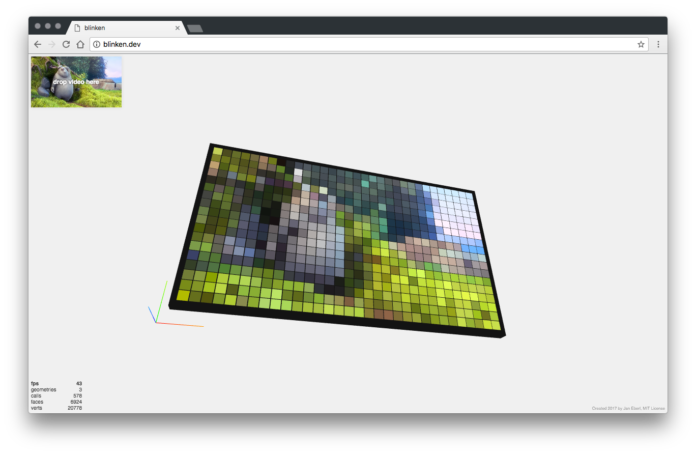

# blinken
A 3D web-based RGB LED / NeoPixel Array Simulator in three.js.

A live demo can be found at [stfu.janeberl.de/blinken](https://stfu.janeberl.de/blinken/)

# How to build & run
Contents in the dist folder are pre-built.
If you plan on developing in the source folder, simply run `$ npm install` to install dependencies and `$ grunt` to build. A watcher task can be launched with `grunt run`.

# What it does
blinken simulates an RGB matrix (dots or NeoPixel are simulated at the moment) and spawns a set number of 3d Objects (matrix of x by y, configurable in `blinken.js`) and applies emissive material colors to them based on a given array of RGB values. This mode of input has been chosen because of the nature of data input one would give a real, physical RGB LED hardware array. The source for the color information is a video input, simulated by an HTML5 video element. A sample video is included, you can drag & drop any video file supported by your browser onto the video preview to load and play it.

# Configuration
You can change width or height of the matrix in `blinken.js` by editing the `mWidth`and `mheight` attributes. Be careful though, high values tend to have a huge performance impact.

There are two hardware modes (configurable as `neoPixel` bool variable in `blinken.js`), resulting in dot or NeoPixel Cube style display.

There are 5 input modes (configurable in `blinken.js`):
* 0 - Scaled mode: The input is scaled onto the output matrix both in width and height.
* 1 - Top mode: The original input height is drawn from the top, the width is scaled to the output width.
* 2 - Bottom mode: The original input height is drawn from the bottom, the width is scaled to the output width.
* 3 - Left mode: The original input width is drawn from the left, the height is scaled to the output height.
* 4 - Right mode: The original input width is drawn from the right, the height is scaled to the output height.

# What it does not do (for now)
blinken does not yet support other video sources, although I have successfully played around with a combination of ffmpeg and socket.io to simulate live video input. This is merely a base for everything you can come up with.
